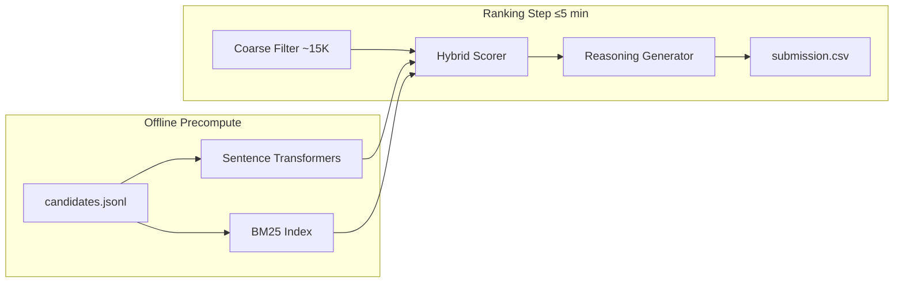

# Redrob Intelligent Candidate Discovery Engine

[](https://www.python.org/downloads/)
[](LICENSE)
[](#testing)

Production-grade hybrid ranking system for the **Redrob Data & AI Challenge — Intelligent Candidate Discovery**. Ranks the top 100 candidates from a 100,000-profile pool against a Senior AI Engineer job description using semantic matching, structured resume features, behavioral signals, and explicit anti-trap guards.

---

## Problem

Given 100,000 anonymized candidate profiles and a detailed job description, produce a ranked top-100 submission optimized for hidden NDCG@10 scoring while:

- Passing strict CSV format validation
- Running within **5 minutes / 16 GB RAM / CPU-only / no network**
- Avoiding dataset traps (keyword stuffers, honeypots, inactive candidates)
- Providing explainable, factual reasoning for Stage 4 review

---

## Quick Start

```bash
git clone <your-repo-url>
cd Redrob

python3 -m venv .venv
source .venv/bin/activate
pip install -r requirements.txt

# Place competition bundle in data/raw/ (see Data Setup below)

# One-time offline precompute (~3 min for 100K on M-series Mac)
python main.py precompute --candidates data/raw/candidates.jsonl

# Generate submission (~28s ranking step)
python main.py rank --candidates data/raw/candidates.jsonl --out outputs/submission.csv --validate
```

**Reproduce command** (for `submission_metadata.yaml`):

```bash
python rank.py rank --candidates data/raw/candidates.jsonl --out outputs/submission.csv --validate
```

---

## Data Setup

Copy the official competition bundle into `data/raw/`:

```
data/raw/
├── candidates.jsonl          # 100,000 candidates (465 MB)
├── candidate_schema.json
├── job_description.docx
├── submission_spec.docx
├── validate_submission.py
└── ...
```

Large files (`candidates.jsonl`, processed embeddings) are gitignored. See [docs/PROJECT_STRUCTURE.md](docs/PROJECT_STRUCTURE.md).

---

## Submission Format

Official output is **CSV** (not Excel):

```csv
candidate_id,rank,score,reasoning
CAND_0018499,1,0.99,"Strong fit: Senior Machine Learning Engineer..."
```

| Column | Type | Rules |
|--------|------|-------|
| `candidate_id` | string | `CAND_XXXXXXX`, unique, must exist in pool |
| `rank` | int | 1–100, each used exactly once |
| `score` | float | Non-increasing with rank; ties broken by `candidate_id` ascending |
| `reasoning` | string | 1–2 sentences; recommended for Stage 4 |

Validate before upload:

```bash
python validate_submission.py outputs/submission.csv
```

Rename to your registered participant ID: `team_xxx.csv`.

---

## Architecture



**Two-stage hybrid ranker:**

1. **Coarse filter** — Retain candidates with title relevance, semantic JD similarity, or career narrative match; exclude honeypots and obvious keyword stuffers.
2. **Full scoring** — Weighted feature blend × behavioral modifier − penalty terms.

See [docs/TECHNICAL_REPORT.md](docs/TECHNICAL_REPORT.md) for full methodology.

---

## Project Structure

```
Redrob/
├── config/
│   ├── jd_profile.yaml           # Structured hiring profile
│   └── ranking_weights.yaml      # Feature weights & thresholds
├── data/
│   ├── raw/                      # Competition bundle (not in git)
│   └── processed/                # Embeddings, BM25, honeypot IDs
├── docs/
│   ├── TECHNICAL_REPORT.md
│   ├── PRESENTATION.md
│   └── PROJECT_STRUCTURE.md
├── notebooks/
│   └── 01_dataset_audit.ipynb
├── outputs/
│   ├── submission.csv            # Final submission
│   ├── eda_report.json
│   └── benchmark.json
├── scripts/
│   ├── run_eda.py
│   └── parse_jd.py
├── src/
│   ├── preprocessing.py          # Canonical text, trap detection
│   ├── semantic_matching.py      # Embeddings + BM25
│   ├── feature_engineering.py    # Structured features
│   ├── behavioral_scoring.py     # Redrob signal modifier
│   ├── ranking_engine.py         # Hybrid ranker + reasoning
│   └── evaluation.py             # Validator wrapper
├── tests/                        # 8 unit + integration tests
├── main.py                       # CLI: precompute | rank | eda
├── rank.py                       # Reproduce entrypoint
├── validate_submission.py        # Official format validator
├── submission_metadata.yaml      # Portal metadata template
├── requirements.txt
├── LICENSE
└── README.md
```

---

## Configuration

| File | Purpose |
|------|---------|
| `config/jd_profile.yaml` | Must-have skills, positive/negative titles, career keywords, disqualifiers |
| `config/ranking_weights.yaml` | Feature weights, coarse filter thresholds, score range |

Weights are tunable without code changes.

---

## CLI Reference

```bash
python main.py precompute [--candidates PATH] [--model MODEL]
python main.py rank       [--candidates PATH] [--out PATH] [--validate]
python main.py eda        [--candidates PATH] [--out PATH]
```

---

## Testing

```bash
pytest tests/ -q                  # Unit tests (~1s + 28s benchmark)
pytest tests/ -q -k "not benchmark"  # Skip full 100K benchmark
```

Benchmark test verifies: runtime < 5 min, validator pass, honeypot rate ≤ 10%.

---

## Results (Current Run)

| Metric | Value |
|--------|-------|
| Ranking runtime | **19–28s** on 100K candidates |
| Validator | **Passed** |
| Honeypots in top 100 | **0%** |
| Top rank #1 | Senior ML Engineer, 7.2 yrs, Noida |
| Unique reasoning strings | 100/100 |

Full analysis: [docs/TECHNICAL_REPORT.md](docs/TECHNICAL_REPORT.md)

---

## Compute Constraints

| Phase | Time | Network | GPU |
|-------|------|---------|-----|
| Precompute | Offline OK | Required once (model download) | Optional |
| Ranking | ≤ 5 min | **Off** | **Off** |

---

## Documentation

- [Technical Report](docs/TECHNICAL_REPORT.md) — Full methodology and validation
- [Presentation](docs/PRESENTATION.md) — 10-slide deck content
- [Project Structure](docs/PROJECT_STRUCTURE.md) — File-by-file reference

---

## Submission Checklist

- [ ] Fill in `submission_metadata.yaml` (team name, GitHub, sandbox link)
- [ ] Run `python main.py rank ... --validate`
- [ ] Rename `outputs/submission.csv` → `team_xxx.csv`
- [ ] Upload CSV + metadata via competition portal
- [ ] Ensure GitHub repo is accessible for Stage 3 reproduction

---

## License

MIT — see [LICENSE](LICENSE).

---

## Acknowledgments

Built for the Redrob Intelligent Candidate Discovery & Ranking Challenge. Dataset and validator provided by Redrob AI.
